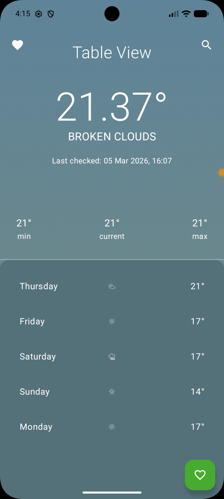
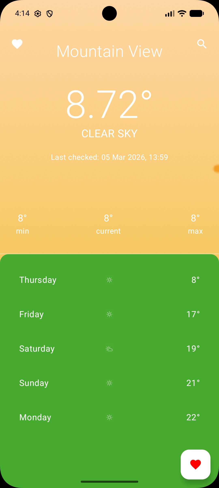
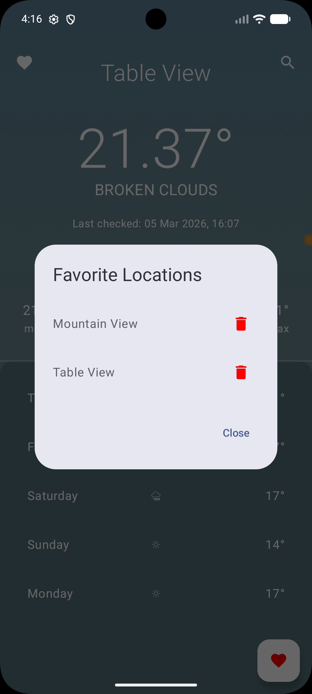

# WeatherApp

A modern, robust Android weather application built with Kotlin and Jetpack Compose, following Clean
Architecture principles.

## 📱 Screenshots

  
  
  

## 🏗 Architecture & Design Considerations

This project follows **Clean Architecture** with a clear separation of concerns across three layers:

- **Data Layer**: Responsible for data retrieval from network (Retrofit) and local persistence (
  Room). It implements the repository interfaces defined in the domain layer.
- **Domain Layer**: Contains the business logic of the application. It includes models, repository
  interfaces, and use cases. This layer is pure Kotlin and has no dependency on Android frameworks.
- **UI Layer (Presentation)**: Built with Jetpack Compose, following the **MVVM (
  Model-View-ViewModel)** pattern. It handles user interactions and observes data from the domain
  layer.

### General Considerations & Conventions

- **Dependency Injection**: Managed by Hilt for decoupling and easier testing.
- **Asynchronous Programming**: Uses Kotlin Coroutines and Flow for reactive data streams and
  background tasks.
- **View States**: UI state is managed using `StateFlow` to ensure a single source of truth and
  lifecycle awareness.
- **Naming Conventions**: Follows standard Kotlin coding conventions (PascalCase for classes,
  camelCase for functions/variables).

---

## 💾 Local Persistence & Offline Support

The application leverages **Room Database** to provide a seamless user experience even without an
active internet connection.

### Core Features:

- **Weather Caching**: Latest weather data and 5-day forecasts are cached locally. If a network
  request fails, the app displays the last known data stored in the database.
- **Favorite Locations**: Users can "favorite" specific cities or locations.
    - This is managed via the `isFavorite` flag in the `LocationEntity`.
    - Favorites are persisted across app restarts, allowing users to quickly access weather for
      their preferred spots.
    - The `LocationDao` provides efficient queries to toggle favorite status and retrieve the list
      of saved locations.
- **Offline Resilience**: By using a "Single Source of Truth" pattern (the database), the UI always
  observes the local database, which is updated whenever fresh data is fetched from the
  OpenWeatherMap API.

---

## 🛠 Third-Party Libraries

An exhaustive list of the libraries used and their purpose:

### Core / UI

- **Jetpack Compose**: Modern toolkit for building native UI.
- **Material 3**: Latest Material Design components.
- **Hilt**: Dependency injection specifically tailored for Android.
- **Hilt Navigation Compose**: For injecting ViewModels into Navigation-based Compose apps.

### Networking & Data

- **Retrofit**: Type-safe HTTP client for network requests to weather APIs.
- **OkHttp Logging Interceptor**: For inspecting network traffic during development.
- **Gson / Moshi**: For parsing JSON responses into Kotlin objects.
- **Room**: SQLite abstraction for local weather data persistence.

### Utilities

- **Play Services Location**: For fetching the user's current geographic coordinates.
- **Secrets Gradle Plugin**: Securely manages API keys from `local.properties`.

### Testing

- **JUnit 4**: Standard testing framework.
- **MockK**: Powerful mocking library for Kotlin.
- **Kotlinx Coroutines Test**: Testing utilities for coroutines (e.g., `runTest`).

---

## 🚀 How to Build

### Prerequisites

- Android Studio Ladybug (or newer).
- JDK 17+.

### Configuration

1. **Clone the repository**:
   ```bash
   git clone <repository-url>
   ```
2. **API Keys Configuration**:
   This project uses the [Secrets Gradle Plugin](https://github.com/google/secrets-gradle-plugin) to
   manage API keys securely. To build and run the application, you **must** add the following keys
   to your `local.properties` file in the project root.

    * **OpenWeatherMap API Key**: Required for fetching real-time weather data.
        1. Sign up and get a key from [OpenWeatherMap](https://openweathermap.org/api).
        2. Add to `local.properties`: `WEATHER_API_KEY=your_weather_api_key_here`

    * **Google Places API Key**: Required for the city search and autocomplete features.
        1. Create a project in the [Google Cloud Console](https://console.cloud.google.com/).
        2. Enable the **Places API (New)**.
        3. Create an API Key and add to `local.properties`:
           `GOOGLE_PLACES_API_KEY=your_google_api_key_here`

   **Example `local.properties` content**:
   ```properties
   WEATHER_API_KEY=YOUR_API_KEY_HERE
   GOOGLE_PLACES_API_KEY=YOUR_API_KEY_HERE
   ```

3. **Sync Gradle**:
   Open the project in Android Studio and wait for the Gradle sync to complete.

### Building & Running

- To build the project, run: `./gradlew assembleDebug`
- To run the application, select the `app` configuration and click **Run** in Android Studio.

---

## 🧪 Running Tests

- **Unit Tests**: `./gradlew test`
- **Instrumented Tests**: `./gradlew connectedAndroidTest`
